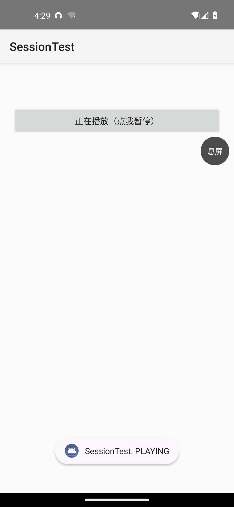
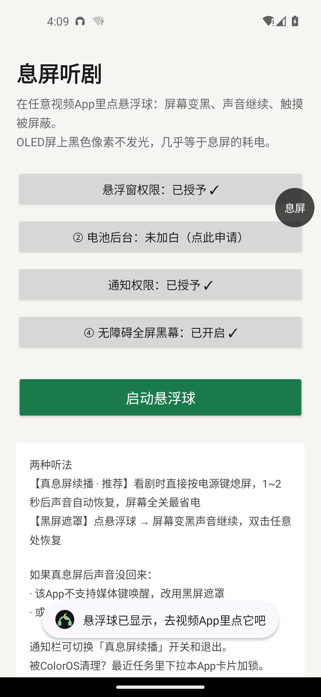
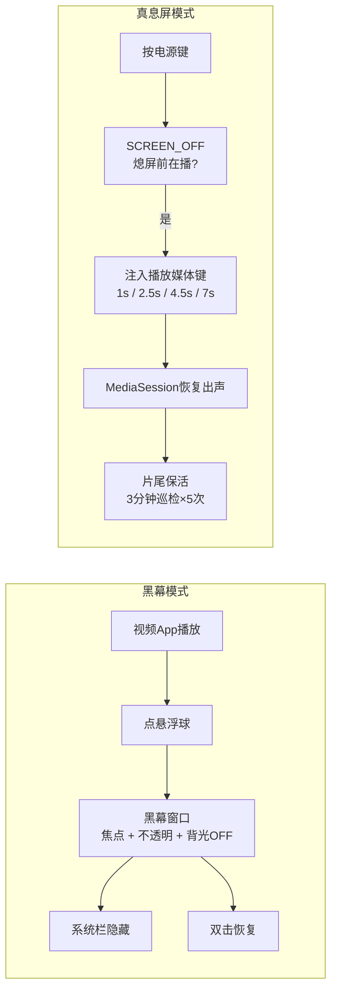

<div align="center">


[下载最新版](https://github.com/ch1209498273/XiTing/releases/latest) · [使用说明](#使用) · [常见问题](#faq)


</div>

## 它解决什么

手机没有"息屏听剧"功能？这个App补上：

- **黑幕模式** —— 任意视频App里点悬浮球，整块屏幕（含状态栏、导航栏）背光物理关闭，视频照常出声，触摸全部屏蔽
- **真息屏模式** —— 直接按电源键，熄屏后声音自动恢复，最省电
- 听网课、听播客、挂直播，同理可用

专为 ColorOS 深度适配：状态栏、导航栏、手势条全部盖黑，和真息屏一样干净。

## 效果一览

| 视频App播放中 | 点「息屏」悬浮球 | 息屏听剧中 |
|:---:|:---:|:---:|
|  |  |  |
| 正常看剧 | 黑幕就位·防误触 | 背光关闭·声音继续 |

## 使用

1. 安装后打开App，按提示完成四项授权
2. 建议再做两步防清理：电池白名单 + 最近任务加锁
3. 视频App里点悬浮球，或直接按电源键

> 轻点屏幕解除锁定，点「返回视频」按钮回到画面 · 通知栏可随时退出

## 工作原理

**黑幕模式**：黑幕作为有焦点的全屏不透明窗口，携带 `screenBrightness = BRIGHTNESS_OVERRIDE_OFF` —— 系统据此**物理关闭背光**，同时通过 `WindowInsetsController` 隐藏系统栏。视频App全程以为自己在前台，所以照常出声。

**真息屏模式**：熄屏广播到达后，向系统注入标准媒体键（`dispatchMediaKeyEvent`），由视频App自己的 MediaSession 恢复播放；片尾被掐断时，3分钟保活窗口内自动续上。

<details>
<summary>流程图（点开）</summary>



</details>

## FAQ

**和小米的息屏听剧一样吗？**
体验对齐：黑幕下背光完全关闭，和真息屏一样黑、一样省电，而且任意App可用。

**为什么有的App熄屏后没声音？**
该App不响应系统媒体键。改用黑幕模式，或打开App自带的"后台播放"开关。

**费电吗？**
黑幕/真息屏下背光已关闭，显示耗电≈0；剩余耗电来自视频解码本身。

**安全吗？**
无 INTERNET 权限，无法联网；无障碍服务不读取任何屏幕内容（可在系统设置中核验）。

## 构建

```bash
git clone https://github.com/ch1209498273/XiTing.git
cd XiTing && gradle assembleDebug
```

要求 JDK 17+、Android SDK 36。

## 声明

本项目仅供学习交流，请支持正版与内容创作者。与 YouTube、Google 及任何视频平台无关联。
