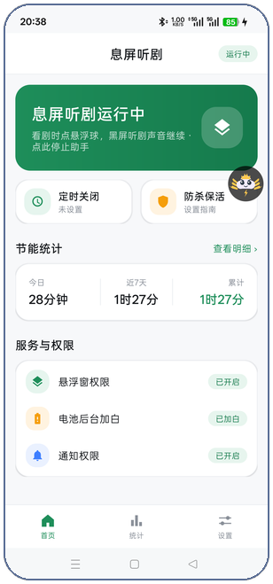
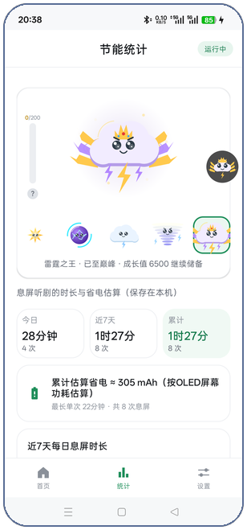
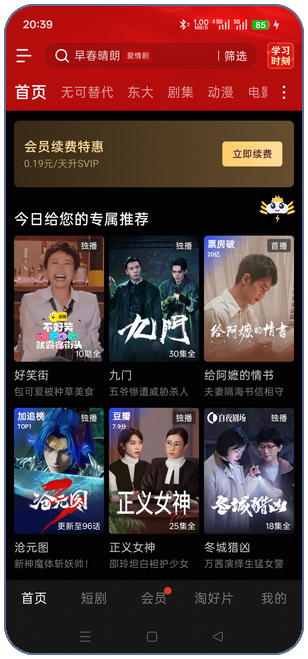

<div align="center">


**看剧时一键熄屏，声音继续 —— 任意视频App可用**

[下载最新版](https://github.com/ch1209498273/XiTing/releases/latest) · [使用说明](#使用) · [常见问题](#faq)


> **v3.0 正式版** · 新增电能精灵养成系统与卸载重装数据恢复

</div>

## 它解决什么

手机没有"息屏听剧"功能？这个App补上：任意视频App里点悬浮球（或主界面一键），整块屏幕（含状态栏、导航栏）**背光物理关闭**、触摸全部屏蔽，声音照常播放。

听网课、听播客、挂直播，同理可用。专为 ColorOS 深度适配，上下边缘不留亮线。

## 核心功能

- **一键息屏听剧** —— 主界面点一下，自动拉起助手并直接进入全屏黑幕
- **悬浮球** —— 六种样式可选（息屏文字 / 五形态精灵头像），带呼吸眨眼动画，拖动自动贴边
- **睡眠定时** —— 15 / 30 / 60 分钟到点自动收黑幕
- **黑幕时钟 + 电量**（可选）—— 夜间看时间不用亮屏；内容每 45 秒微弱位移，保护 OLED 屏幕
- **黑幕播放控制**（可选）—— 唤醒后 ⏮ ⏸ ⏭ 切集/暂停，图标随播放状态切换
- **未读通知角标**（可选）—— 黑幕上显示未读消息数
- **来电自动退出** —— 不会漏接电话
- **防杀保活引导** —— 三步设置解决系统清理后台
- **分享给朋友** —— 每天一次 +5 待收成长值
- **0.9MB · 完全离线 · 无广告** —— 无 INTERNET 权限，物理上无法联网

## 电能精灵（v3.0）

听剧喂养的程序化养成宠物（全 Canvas 手绘，零图片资源）：

- **五形态进化**：电火花 → 电球 → 雷云精灵 → 风暴之灵 → 雷霆之王（星形 / 等离子球 / 积云 / 龙卷风 / 雷电双翼王冠）
- **成长值体系**：听剧每满 1 分钟产生 1 点，每日首次分享 +5；形态越高阈值越深（30 分钟 / 5 小时 / 25 小时 / 100 小时）
- **亲手收取**：成长值先进入左侧待收条（上限 200），点条收取计入等级；3 天不收取会过期，临期部分显示为红色
- **形态图鉴**：全彩预览任意形态，提前看到后续样子
- **满级继续储备**：满级后成长值继续累积，为新精灵预留
- **互动动画**：每个形态有专属点击效果（星芒 / 等离子爆裂 / 雷阵雨 / 龙卷加速 / 十二道金雷）

## 数据与隐私

- **零网络权限**：无 INTERNET，物理上无法联网；无广告、无追踪、无埋点
- **自动备份**：成长值与统计自动备份到下载目录 XiTing 文件夹（含设备指纹，仅本机可见）
- **卸载重装可恢复**：重装后首次启动选择备份文件即可一键恢复全部数据
- 所有数据仅保存在本机
- 📄 [隐私政策全文（PRIVACY.md）](PRIVACY.md)

## 界面速览

| 首页 | 电能精灵 | 看剧息屏 | 黑屏听剧 |
|:---:|:---:|:---:|:---:|
|  |  |  |  |

## 使用

1. 安装后打开App，完成三项授权（悬浮窗 / 电池加白 / 通知）
2. 点「启动息屏听剧」
3. 看剧时点悬浮球 → 全屏黑幕，声音继续

> 黑幕下轻点屏幕唤醒 → 定时/媒体控制/返回按钮浮现；长按拖动悬浮球可移动（自动贴边）

## 常见问题

**和小米的息屏听剧一样吗？**
视觉效果一致——黑幕下背光完全关闭，和真息屏一样黑、一样省电，而且任意App可用。

**支持按电源键真息屏续播吗？**
暂不支持。真息屏续播依赖媒体键注入 + 后台存活，在 ColorOS 的激进后台策略下会被系统冻结拦截；黑幕模式已达到同样的显示与省电效果。

**费电吗？**
黑幕下背光已关闭，显示耗电≈0；剩余耗电来自视频解码本身。

**悬浮球突然不见了？**
打开 App 查看「悬浮窗权限」行：如显示橙红色「异常·点修复」，点它后把系统悬浮窗开关关闭再重新打开即可。

## 构建

```bash
git clone https://github.com/ch1209498273/XiTing.git
cd XiTing && gradle assembleDebug
```

要求 JDK 17+、Android SDK 36。

## 许可

非商业许可：个人学习交流可自由使用与分享（需保留署名）；**任何商业用途均被禁止**；禁止移除或篡改应用内署名与溯源标识。详见 [LICENSE](LICENSE)。

本项目与 YouTube、Google 及任何视频平台无关联。
